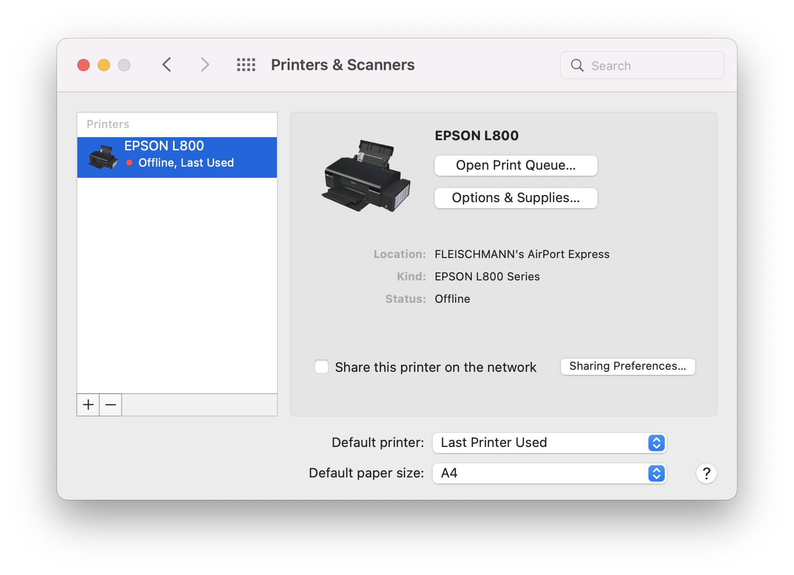
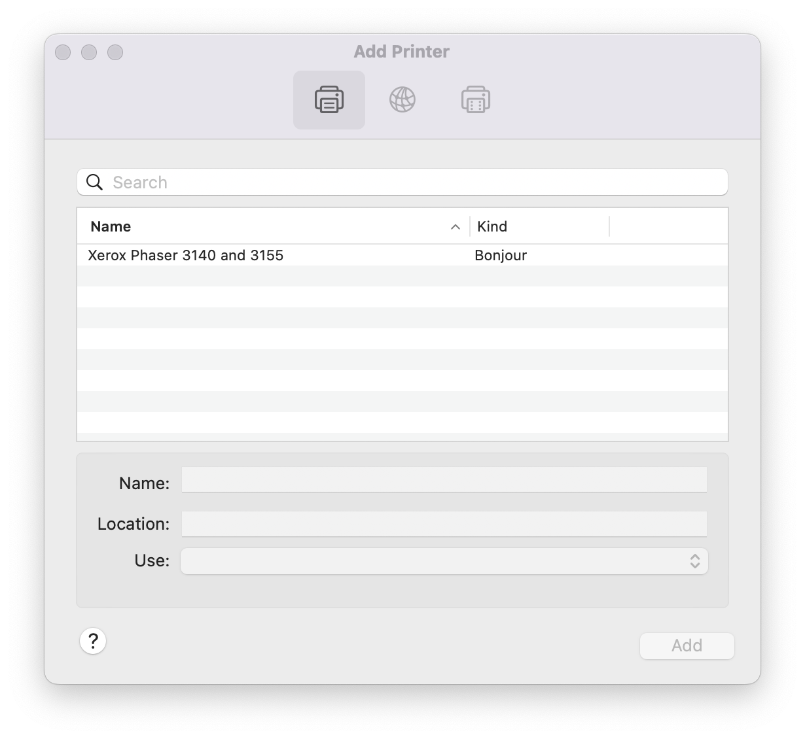
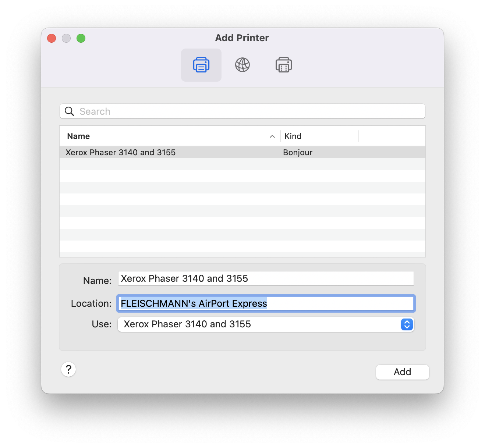
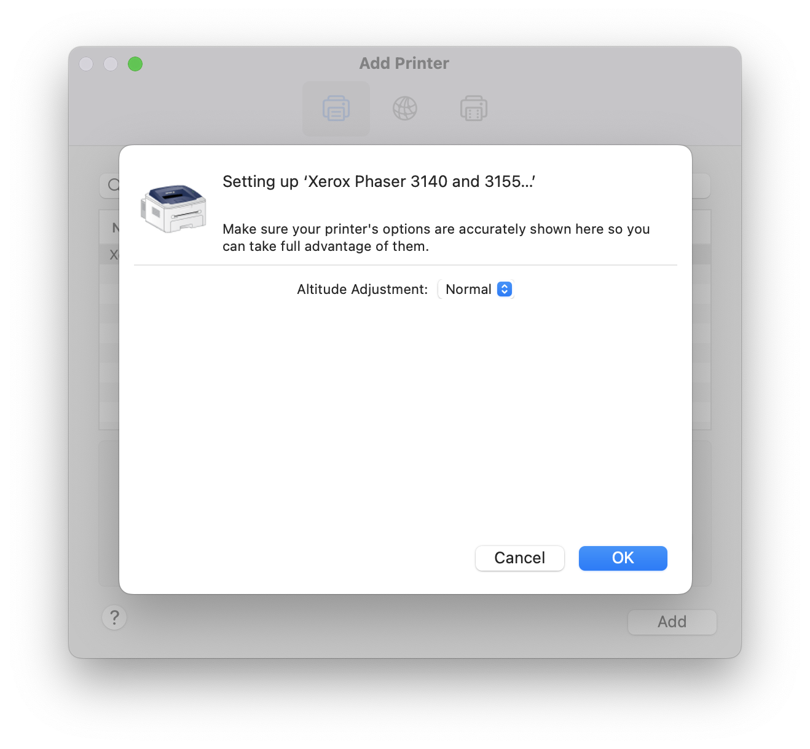
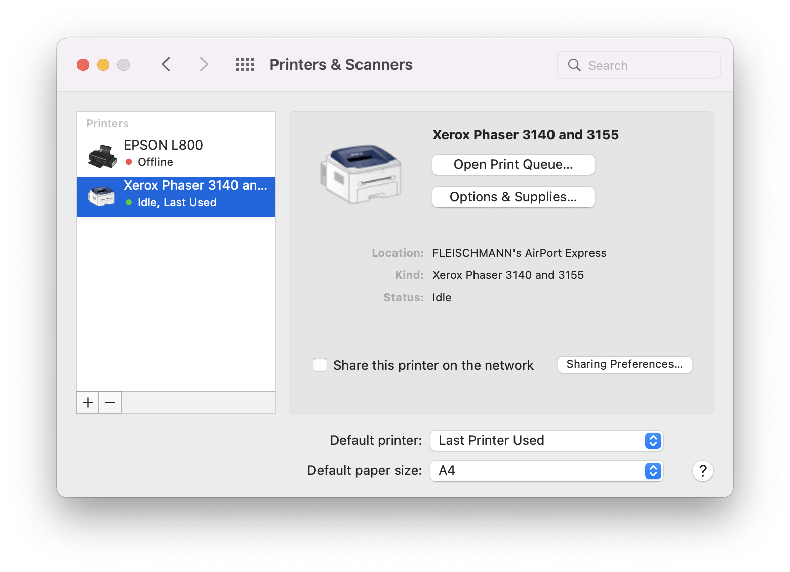
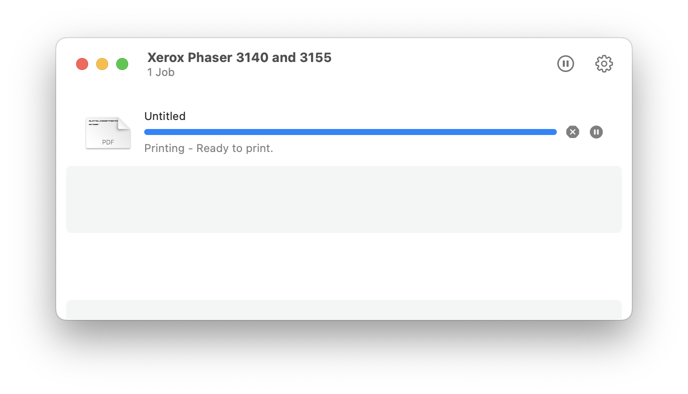

# Xerox-Phaser-3140-3155-macOS-Catalina-Big-Sur-Monterey-driver

Xerox Phaser 3140/3155 macOS Catalina (version 10.15), Big Sur (version 11), Monterey (version 12) driver

I tried to do it bymyself based on the [Gist](https://gist.github.com/santiago26/60425d2759b1360555111caa47b6769f), but it didn't work with the driver over there so I installed the driver on an old Macintosh machine running macOS Mojave (version 10.14.6) and copied the files from there.

The files can be found here: [link](driver/Xerox_Phaser_3140_3155_macOS_Catalina_Big_Sur_Monterey_driver.zip) /* There's a Download button on the right side... */

And it worked.

## Installation

Copy all of the files and directories to the right place on your machine manually:

```
copy Library/Printers/Xerox/Phaser_3140_3155/* to /Library/Printers/Xerox/Phaser_3140_3155
copy Library/Printers/PPDs/Contents/Resources/Xerox Phaser 3140 and 3155.gz /Library/Printers/PPDs/Contents/Resources/Xerox Phaser 3140 and 3155.gz
copy private/etc/cups/ppd/Xerox_Phaser_3140_and_3155.ppd /private/etc/cups/ppd/Xerox_Phaser_3140_and_3155.ppd
```

and install the printer as usual:







Test print:



[Tada.wav](https://www.youtube.com/watch?v=QDUv_8Dw-Mw&ab_channel=ProductDesignsYT)